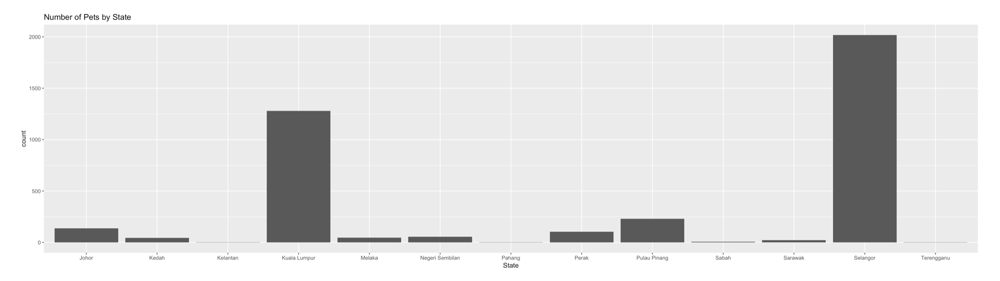
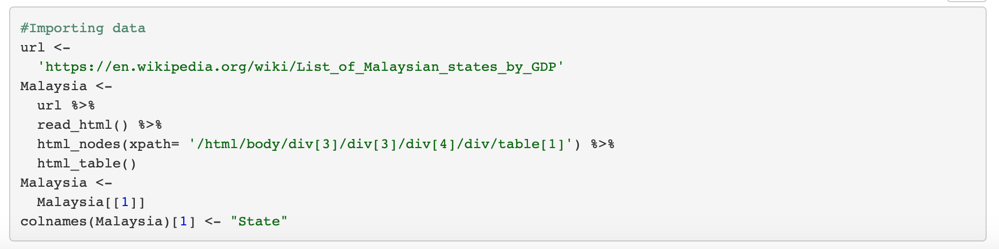
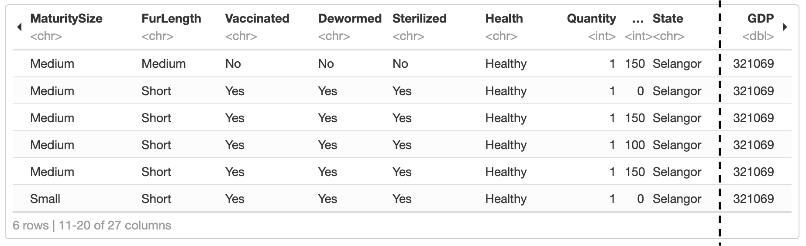
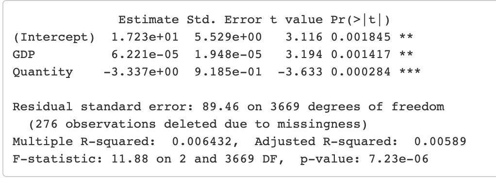
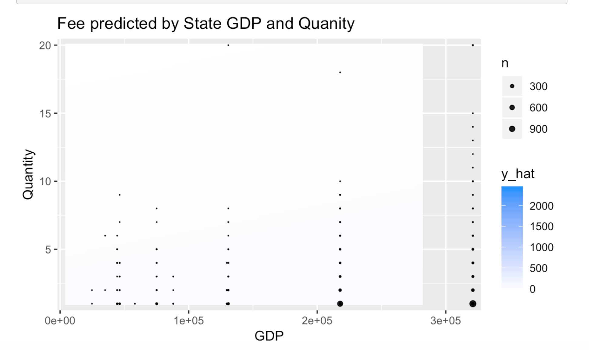

# Pet Finder Project 

PetFinder was a group project for a data science class.  I decided to extract the parts of the project I wrote to have an example of my skills using R. 

We were inspired my the Kaggle competition that wanted people to predict the adpotion outcomes of pet. Instead of following the competiton, we decided to look at the data and see if there was any recommendations for changes we would make to animal shelters to help increase adptions.  

First, I took data from wikipeadia on the Malaysian economy to help evaluate animal fees using a logistic model. My other task was to analyse pet names, and see if any animals could benefit from having thier name changed. 

Techniques Used:
* [Visulation](#visulation)
* [Data Scaping](#data-scaping) 
* [Data Wrangling](#data-wrangling) 
* [Machine Learning](#machine-learning) 
* [Regular Expressions](#regular-expressions) 

## Visulation

This simple bar chart shows the population of pets by the state of Malaysia. It helps us see the spread of pets over the country. By seeing that there are a decent amount of pets in each state, we know that it could be worth looking at the states of Malaysia in more detail.

## Data Scaping

After looking at the previous graph, I decided to look at data for the economy of the Malaysian states. The data table was taken from Wikipedia on the economy for each state in Malaysia.

## Data Wrangling 

I joined the two data tables together to make it easier to analyze the data together.

## Machine Learning 

Here I used a simple logistic model to look at how GDP and quantity of pets in each state could be correlated to the fee for pets. This could help us evaluate if the shelters should explore changes in fees.

I made a graph to help visualize the model’s prediction.

With an R-squared value close to zero, we can see that there is little correlation between the fee as the response variable and quantity if that type of animal and GDP of the state the animal is from. It may be beneficial for Malaysia have lower prices in lower states or transfer more expensive/desirable dogs to richer states.

## Regular Expressions 

For my final task, I used the sentiments data set to analyize the names of pets.  The sentiments data is a list of words and a numerical value that gives their sentiments. Sentiments is a continuous variable with positive and negative numbers that show the degree of positive or negative sentiment based on a survey.

11 animals have names with negative scores. Shelters may want to consider changing these names to help get these animals adopted.

## Credits

Kaggle competition: https://www.kaggle.com/c/petfinder-adoption-prediction

Malaysia Economy Data: https://en.wikipedia.org/wiki/List_of_Malaysian_states_by_GDP

Class Professor: Dr. Matthew Beckman

Group Member: Shelby Krenn
